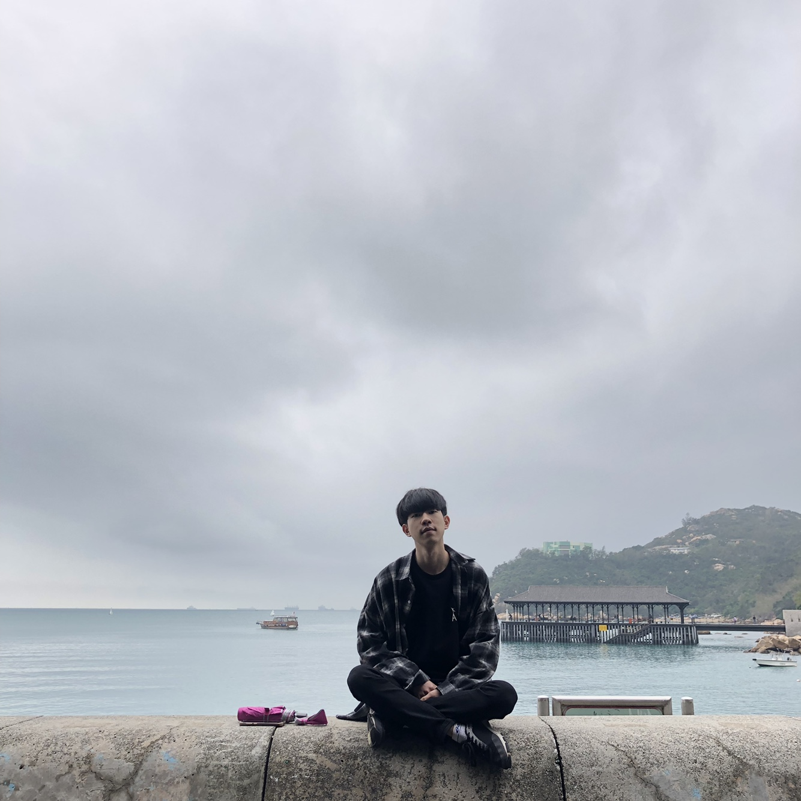

<h1 align="center">🖥️ 안녕하세요 이현빈입니다! 👋</h1>

  

## 🔧 Tech Stack

### 💻 Language  

### 🧱 Framework & Library  

### 🎮 Game Engine  

### 🗄 Database  

### 🔧 Tools  

---

### 🏢 (주)위코다 | 게임 클라이언트 개발자
*2023.11 ~ 2025.05 (1년 6개월)*  
- Unity 기반 모바일 SRPG 클라이언트 개발
- DOTween, Spine 애니메이션 기반 UI/UX 연출 담당
- Addressable 및 리소스 최적화 작업 수행
- Google Play / iOS 양 플랫폼 배포 및 유지보수

## 📑 담당 프로젝트

| 프로젝트명         | 설명                                                                 | 바로가기 |
|--------------------|----------------------------------------------------------------------|----------|
| 🎮 MeetCoda            | 플랫폼 내 점프 액션 미니게임. Spine 애니메이션, DOTween 기반 UI 개발 |   |
| ♻️ 재활용사키우기     | 재활용 소재 수집 및 성장형 시뮬레이션. 클라이언트 및 서버 연동(WebManager) 개발 |    |

---

## 🧠 알고리즘

---

## 💬 About Me

- 🎓 SSAFY (삼성청년SW아카데미) 진행 중
- 🏆 충청권게임인디유공모전 - 장려상 - [플레이영상](https://youtu.be/SNeIs3Hy_Tk)
- 🏆 2023 SW창의융합 경진대회 - 자립상 (1위) - [PV](https://youtu.be/Jzckma3huPg)

---

## 📫 Contact

- ✉️ Email: **991357@naver.com**
